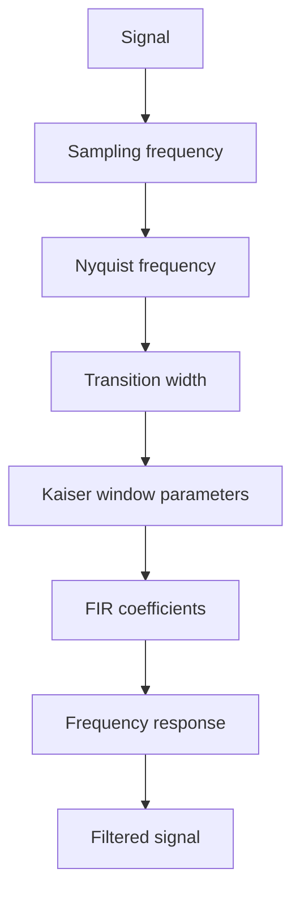
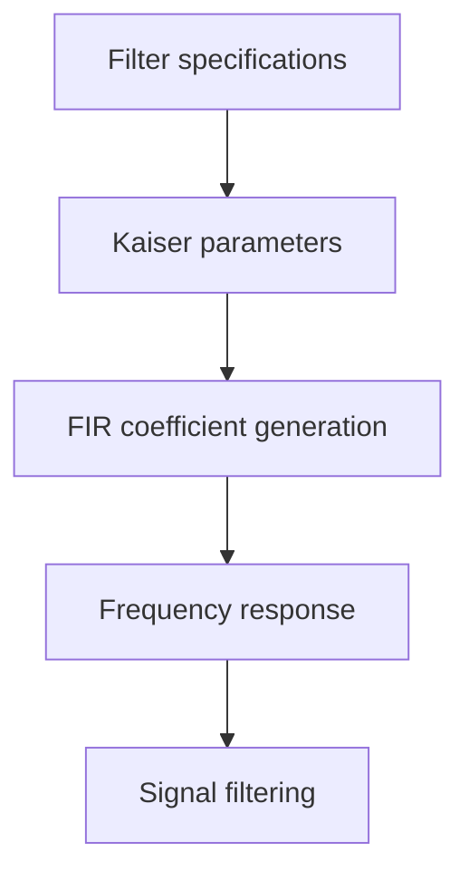
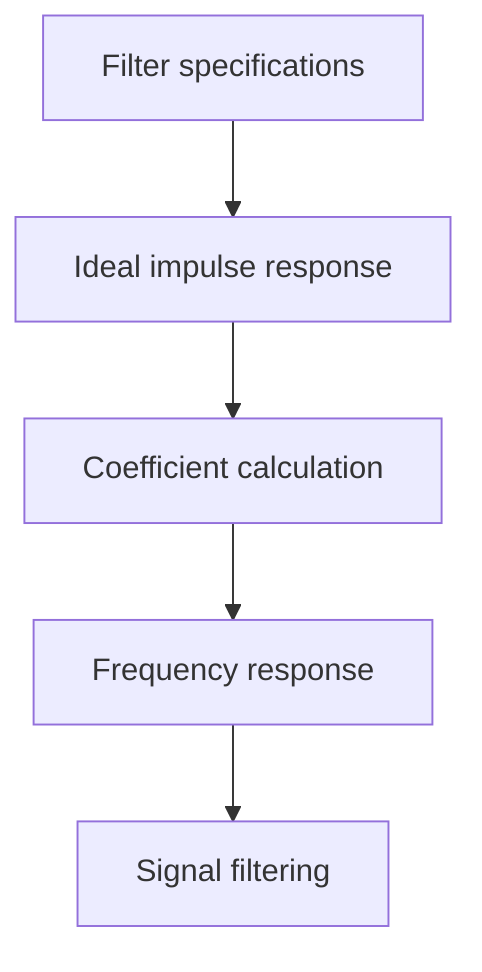

# FIR Filter Design and Audio Signal Analysis

Academic project focused on the **analysis, design, implementation, and evaluation of Finite Impulse Response (FIR) filters** applied to real audio signals.

The project uses a clean electric guitar recording as the input signal and combines **time-domain analysis, FFT, spectrograms, theoretical filter design, Python-based filter implementation, and correlation analysis** to study the effect of different frequency responses on the resulting audio.

> **Course:** Digital Signal Processing — Universidad de Antioquia
> **Semester:** 2024-1
> **Project type:** Academic / Signal Processing

---

## Overview

The objective of this project was to design and evaluate FIR filters capable of isolating different frequency regions of an audio signal.

The input material consists of **clean electric guitar chords**, recorded through an audio interface. Frequency-domain analysis was first performed to identify the relevant spectral components of the recording. Based on this analysis, three filters were designed:

* **Low-pass filter:** 600 Hz cutoff
* **Band-pass filter:** 600–1200 Hz passband
* **High-pass filter:** 1200 Hz cutoff

The filters were evaluated both through their frequency responses and by applying them directly to the guitar recording. The resulting signals were analyzed in the time and frequency domains and compared with the original signal using Pearson correlation.

---

## Project Highlights

* Frequency-domain analysis using **Fast Fourier Transform (FFT)**
* Time-frequency analysis using **spectrograms**
* FIR filter design using **Kaiser-window-based** methods
* Manual/theoretical FIR filter coefficient calculation
* Low-pass, band-pass, and high-pass filter implementations
* Signal filtering using `scipy.signal.lfilter`
* Frequency-response analysis using `scipy.signal.freqz`
* Comparison between theoretical and Python-based approaches
* Quantitative comparison using **Pearson correlation**
* Audio visualization and playback
* Practical application to a real musical signal

---

## Signal Analysis

Before designing the filters, the guitar recording was normalized and analyzed in both the time and frequency domains.

### Time-Domain Signal

The original waveform provides a first view of the recorded guitar chord and its temporal evolution.


https://github.com/user-attachments/assets/a60530e7-0dd0-455b-a4c3-663d493d33ff


The notebook uses `SOL.wav` as the primary example for the analysis.

### Frequency Spectrum

An FFT was used to examine the spectral content of the recording. The analysis shows a rich harmonic spectrum with significant components distributed across the audible frequency range.


Two frequency ranges were visualized in the analysis, including a broader spectrum up to 5000 Hz and a closer view up to 2000 Hz.

### Spectrogram

A spectrogram was used to observe how the frequency components evolve over time.


The analysis uses a 4096-point FFT window with overlap to provide a detailed time-frequency representation of the signal.

---

## FIR Filter Design

Three FIR filters were designed to investigate the contribution of different frequency regions to the guitar signal.

| Filter    | Frequency specification | Purpose                                  |
| --------- | ----------------------: | ---------------------------------------- |
| Low-pass  |           600 Hz cutoff | Preserve lower-frequency components      |
| Band-pass |             600–1200 Hz | Isolate the intermediate frequency range |
| High-pass |          1200 Hz cutoff | Preserve higher-frequency components     |

The filter specifications use a **200 Hz transition width** and a target attenuation/ripple parameter of **60 dB** for the Python-based Kaiser-window design.

---

## Python-Based Design

The first implementation uses functions from `scipy.signal` to determine the Kaiser-window parameters and generate the FIR coefficients.

The main design workflow is:



The implementation uses:

* `kaiserord()` to estimate the filter order and Kaiser parameter
* `firwin()` to generate FIR coefficients
* `freqz()` to analyze the frequency response
* `lfilter()` to apply the filter to the audio signal

### Filter Responses

.

.


The band-pass implementation uses the 600–1200 Hz interval, while the high-pass implementation uses a 1200 Hz cutoff.

---

## Filtered Audio

The filters were applied directly to the normalized guitar recording.

### Low-Pass

.

.

https://github.com/user-attachments/assets/a2a9c69b-e44d-4421-a4b2-f76427e9f2eb


### Band-Pass

.

.

https://github.com/user-attachments/assets/52d58d63-0d4c-46e2-bc15-3db4279c92c8


### High-Pass

.

.

https://github.com/user-attachments/assets/32fbde73-0a0e-4599-a828-09216935af35


These visual and auditory comparisons make it possible to observe how removing different frequency regions changes the character of the original guitar signal.

---

## Comparing the Signals

To quantify the effect of filtering, the original and filtered signals were trimmed to a common length and compared using the **Pearson correlation coefficient**.

The resulting coefficients were:

| Comparison             | Pearson correlation |
| ---------------------- | ------------------: |
| Original vs. Low-pass  |           **−0.23** |
| Original vs. Band-pass |            **0.03** |
| Original vs. High-pass |           **−0.03** |

The low-pass version produced the largest correlation coefficient in magnitude among the three filtered signals. This indicates that, within the tested filter configuration, the lower-frequency portion retained more of the signal characteristics captured by this correlation measure.

> The correlation values should be interpreted as coefficients, not percentages of similarity. In particular, the low-pass result is a coefficient of **−0.23**, not “23% similarity.”

---

## Theoretical FIR Design

The project also explores FIR filter construction from the theoretical definition rather than relying exclusively on high-level filter-design functions.

The manual approach calculates the filter coefficients from the ideal impulse response and uses them to construct the corresponding frequency response and filtered signal.

The notebook develops theoretical low-pass and high-pass filters using the specified cutoff frequencies and transition-width-based filter length.

(Hamming window was used for this case).

### Theoretical Low-Pass Filter


### Theoretical High-Pass Filter


This section connects the mathematical formulation of FIR filters with their practical implementation in Python.

---

## Design Approaches

The project therefore considers two complementary approaches:

### 1. Function-Based Design

The filter is designed using established signal-processing functions from SciPy.



### 2. Theoretical / Manual Design

The filter coefficients are constructed from the theoretical FIR impulse response.



The two approaches provide a useful connection between the **mathematical theory of FIR filters** and their practical implementation using scientific-computing tools.

---

## Technologies

| Technology                 | Purpose                                         |
| -------------------------- | ----------------------------------------------- |
| **Python**                 | Signal-processing implementation                |
| **NumPy**                  | Numerical computation and array processing      |
| **SciPy**                  | FIR design, frequency response, and filtering   |
| **Matplotlib**             | Signal, spectrum, and spectrogram visualization |
| **Pandas**                 | Data handling                                   |
| **Jupyter / Google Colab** | Interactive development and experimentation     |

The original notebook imports NumPy, Matplotlib, Pandas, SciPy, IPython, and audio-processing utilities.

---

## Repository Structure

```text
FIR-Filter-Design/
│
├── filtro_FIR.ipynb
│
├── audio/
│   └── SOL.wav
│
├── images/
│   ├── diagram.png
│   ├── SOL.png
│
└── README.md
```

The exact repository structure may be adjusted depending on which generated figures and audio files are included.

---

## Key Takeaways

* FIR filters can be designed from explicit frequency-domain specifications and applied directly to real audio signals.
* FFT and spectrogram analysis provide complementary views of the signal's spectral content.
* Different filter configurations produce clearly different versions of the original guitar recording.
* High-level signal-processing functions can be connected directly to the underlying FIR filter theory.
* Correlation provides a quantitative way to compare the filtered signals with the original signal, although its interpretation depends on the nature of the waveform changes.
* The project combines **mathematical modeling, programming, signal analysis, visualization, and experimental evaluation** in a single workflow.

---

## Academic Context

This project was developed as a final project for the **Digital Signal Processing** course at Universidad de Antioquia during the 2024-1 semester.

The original assignment required analysis of an instrument recording, frequency-domain characterization, theoretical filter calculations, implementation of multiple filters, comparison of the resulting signals, and evaluation of the theoretical design against Python-based methods.

---

## How to Run

The project was developed as an interactive Python notebook.

### Requirements

* Python 3
* Jupyter Notebook or Google Colab
* NumPy
* SciPy
* Matplotlib
* Pandas
* IPython

### Running locally

Install the required packages:

```bash
pip install numpy scipy matplotlib pandas ipython
```

Then open:

```text
filtro_FIR.ipynb
```

Make sure the required audio file and images are available at the expected path, which is the same folder as the .ipynb file:

The notebook should be executed **in order**, since variables generated in earlier sections are reused by subsequent sections.

---

## License

This repository contains academic work developed for educational purposes.

The source code and original project material are made available under the **MIT License**, except for third-party audio, recordings, or other externally sourced materials whose rights remain with their respective owners.

Third-party material should not be interpreted as being owned by the project author.

---

## Author

**Santiago Giraldo Tabares**

Electronics Engineering — Universidad de Antioquia

**Areas demonstrated in this project:**

`Digital Signal Processing` · `Python` · `FIR Filters` · `FFT` · `Spectrograms` · `Signal Analysis` · `Scientific Computing`
